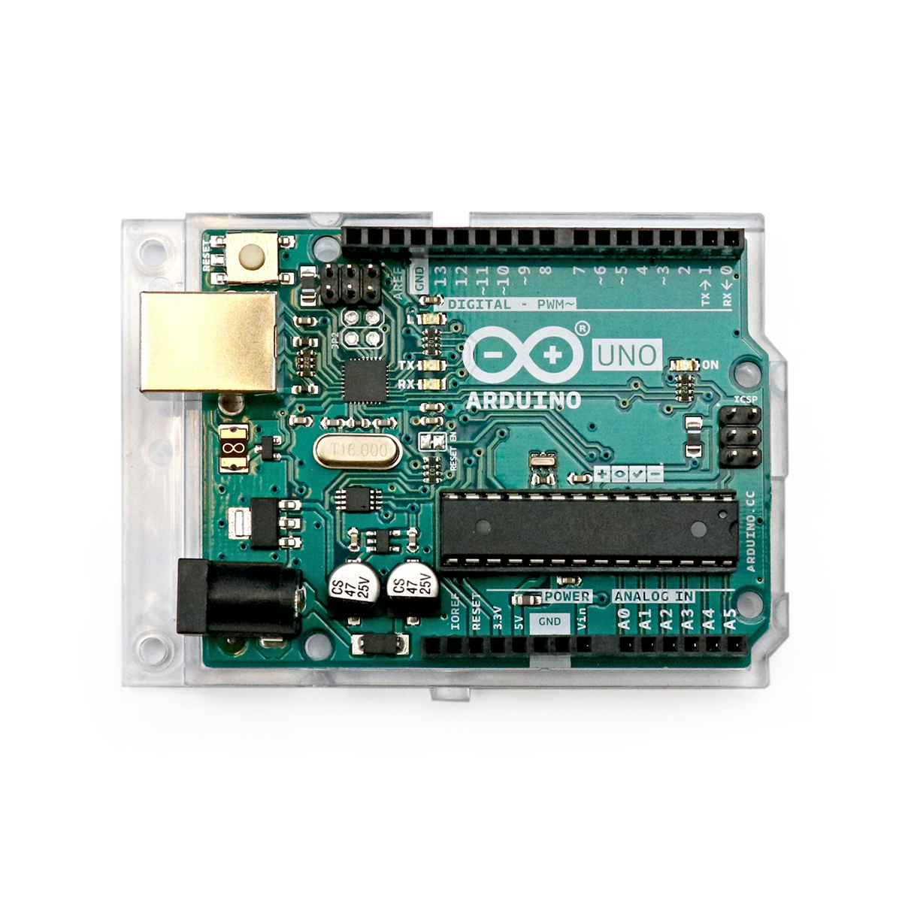

---
title: "Arduino UNO"
date: "2018-08-16T19:55:36.000Z"
tags: 
  - "controller"
coverImage: "1_arduino.jpg"
material_number: "1"
material_type: "controller"
material_short_descr: "Arduino UNO R3"
manufacture: "Arduino"
manufacture_url: "https://arduino.cc/"
repo_name: "mks-Arduino-UNO_R3"
repo_prefix: "mks"
repo_manufacture: "Arduino"
repo_part: "UNO_R3"
product_url: "https://store.arduino.cc/products/arduino-uno-rev3"
clone_url: "https://github.com/Make-Your-School/mks-Arduino-UNO_R3.git"
embedded_example_file: "examples/UNO_R3_minimal/UNO_R3_minimal.ino"
---

# Arduino UNO

## Beschreibung
 

Der Arduino UNO ist ein Mikrocontroller, der es ermöglicht, prinzipiell jegliche Art von technischen Vorgängen automatisiert miteinander zu koordinieren. Dafür besitzt der Mikrocontroller viele \[simple\_tooltip content='Die Mikrocontroller besitzen kleine metallische Kontakte, an die Komponenten, Shields oder andere Platinen angeschlossen werden können. Diese Kontakte werden Pins genannt und können oft als sogenannte GPIO’s (Allzweck Ein- und Ausgabe) eingesetzt werden. Dies bedeutet, dass diese Pins direkt über die Programmierung des Mikrocontrollers angesprochen werden können und hierbei sogar bestimmt werden kann, ob dieser Pin als Eingang (beispielsweise zum Auslesen eines Sensors) oder als Ausgang (beispielsweise zur Steuerung eines Motors) genutzt werden kann. Praktisches Beispiel: Wird am Arduino eine LED an Pin 1 angeschlossen, kann im Programm direkt der Pin 1 als „An” oder „Aus” definiert werden und damit die LED an- oder ausgeschaltet werden. '\]Ein- und Ausgänge\[/simple\_tooltip\] (Inputs und Outputs). Diese sind elektrische Anschlüsse, an die verschiedene technische Komponenten, wie Sensoren oder auch Aktoren (Motoren, Leuchten etc.), angeschlossen werden können. Wird der Mikrocontroller entsprechend programmiert, können diese Komponenten logisch miteinander verknüpft werden. Dadurch können die Komponenten gemeinsam eine technische Aufgabe erfüllen.

Der Arduino wird über die Arduino IDE (Entwicklungsumgebung) frei nach eigenen Wünschen und Anforderungen programmiert. Dazu wird er an einem PC mit der entsprechenden vorinstallierten Software angeschlossen und das Programm „Arduino IDE” gestartet. Das final erstellte Programm wird schließlich auf den Mikrocontroller geladen.

Ein simples Projektbeispiel ist eine Leuchte, die immer dann aufleuchtet, wenn die Umgebung zu dunkel wird. Hierfür wird ein Lichtsensor benötigt, um das Umgebungslicht zu messen. Der Arduino liest den Sensor aus und steuert schließlich die Leuchte, abhängig von der gemessenen Helligkeit.

Durch die große Beliebtheit des Arduino in der wachsenden Community lässt sich fast jedes erdenkliche Projekt mithilfe von im Internet veröffentlichten Erfahrungsberichten umsetzen. Es reicht oftmals nur die Komponenten, die man verbinden möchte, in eine Suchmaschine einzugeben, um entsprechende (Video-)Tutorials zu finden.

Der Arduino UNO ist ein Mikrocontroller, der ursprünglich speziell für Bildungszwecke entwickelt wurde. Durch die einfache Programmierung und den niedrigen Preis hat er allerdings sehr schnell auch in anderen Branchen an Beliebtheit gewonnen. Sowohl Wissenschaftler\*innen als auch Studierende, Hobby-Bastler\*innen, DIY-Begeisterte und viele mehr setzen den Mikrocontroller ein, um unterschiedlichste automatisierte Projekte umzusetzen.

https://www.youtube.com/watch?v=GQw20v8Qls0

 

https://www.youtube.com/watch?v=EEa-0fhb2WA

 

<!-- infolist -->

## Wichtige Links für die ersten Schritte:

- [Arduino Webseite](https://www.arduino.cc/)
- [Arduino IDE](https://www.arduino.cc/en/Main/Software)
- [Technische Daten zum Arduino UNO](https://store.arduino.cc/arduino-uno-rev3)
- [Programmiersprache](https://www.arduino.cc/reference/de/)
- [Instructables Arduino Class (englisch)](https://www.instructables.com/class/Arduino-Class/)

## Projektbeispiele:

- [Arduino Project HUB (englisch)](https://create.arduino.cc/projecthub)
- [Hackster (englisch)](https://www.hackster.io/arduino/projects)
- [Arduino Tutorial (deutsch)](https://www.arduino-tutorial.de/arduino-projekte/)

## Weiterführende Hintergrundinformationen:

- [Arduino - Wikipedia Artikel](https://de.wikipedia.org/wiki/Arduino_\(Plattform\))
- [Mikrocontroller - Wikipedia Artikel](https://de.wikipedia.org/wiki/Mikrocontroller)
- [DIY - Wikipedia Artikel](https://de.wikipedia.org/wiki/Do_it_yourself)
- [GPIO - Wikipedia Artikel](https://de.wikipedia.org/wiki/Allzweckeingabe/-ausgabe)
- [I2C - Wikipedia Artikel](https://de.wikipedia.org/wiki/I%C2%B2C)
- [SPI - Wikipedia Artikel](https://de.wikipedia.org/wiki/Serial_Peripheral_Interface)
- [UART - Wikipedia Artikel](https://de.wikipedia.org/wiki/Universal_Asynchronous_Receiver_Transmitter)

